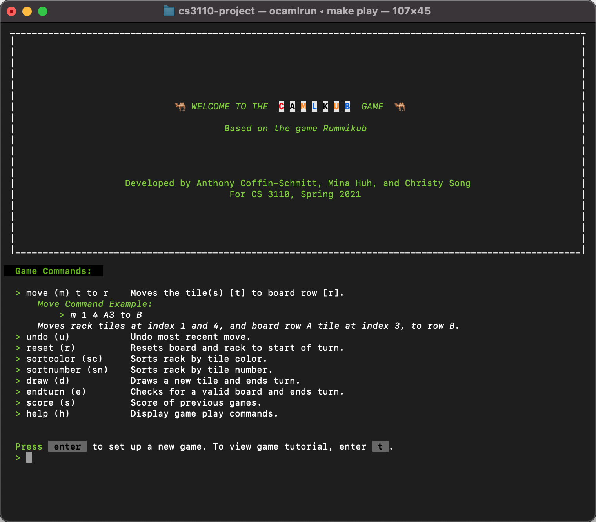
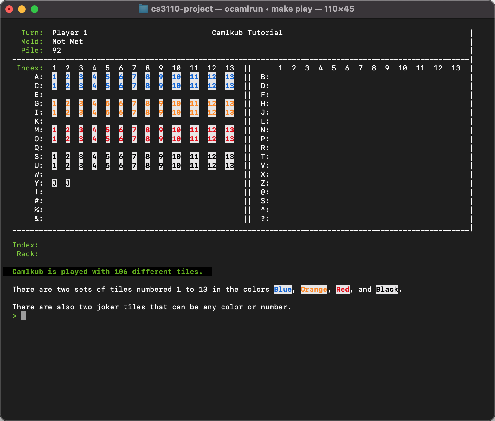

# Camlkub Game - Based on the Game Rummikub

## About the Project

This game was developed as the final project in [CS 3110 - Data Structures and Functional Programming](https://www.cs.cornell.edu/courses/cs3110) Spring 2021 course at Cornell University. The final project is an open-ended team based project focused on agile software development and programmed in the functional language [OCaml](https://ocaml.org/). 

The goal of the project was to build a fun and easy to play Rummikub game, named Camlkub in honor of OCaml. This project was built from scratch by the following people.

### Made by:
- Anthony Coffin-Schmitt
- Mina Huh
- Christy Song

## Game Features
  - REPL based
  - Standard Rummikubs rules enforced
  - New player tutorial
  - Can play with 2, 3, or 4 players
  - Comprehensive gameplay rule checking and warnings to player
  - Play multiple rounds with score keeping
  - Sort rack based on color or number
  - Automatic joker tile number and color assignment

## Installation
See [INSTALL.md](INSTALL.md).

## License
Distributed under the MIT License.
See [LICENSE.md](LICENSE.md) for more information. 

## Game Play Examples

